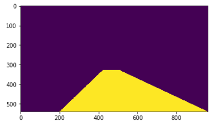

# **Finding Lane Lines on the Road** 

Project 1 of Self-Driving Car ENgineer course

---

**Finding Lane Lines on the Road**

The goals / steps of this project are the following:
* Make a pipeline that finds lane lines on the road
* Reflect on your work in a written report

[//]: # (Image References)

[image1]: ./examples/grayscale.jpg "Grayscale"

---

### Reflection

### 1. Describe your pipeline. As part of the description, explain how you modified the draw_lines() function.

My pipeline consisted of 6 steps. 

- create grayscale image (CV2 method)
- apply Gaussian blur (CV2 method)
- apply Canny Edge finder (CV2 method)
- apply proper plolygon mask to leave only the region pertinent to driving line separators (nice deducive work on most appropriate polygon shape)
- apply  Hough transform to identify line segments (HOuh transforms are extremely cool tool for identifying lines. Read up on it)
- extrapolate the line segments marked by the Hough transform to create just two lines the left and the right

### 2. Identify potential shortcomings with your current pipeline

On regular straight segments it works great but has very short-lived intermittent glitches. They should be OK.
On the advanced video it was obvious that it does not work well on turns.

### 3. Suggest possible improvements to your pipeline

I suspect the intermittent glitches are OK.
I believe the improvement may be to have a dynamic mask that changes the polygon shape when the car is turning.
Because the region of interest on turns is quite different from the region of interest on straight segments.
